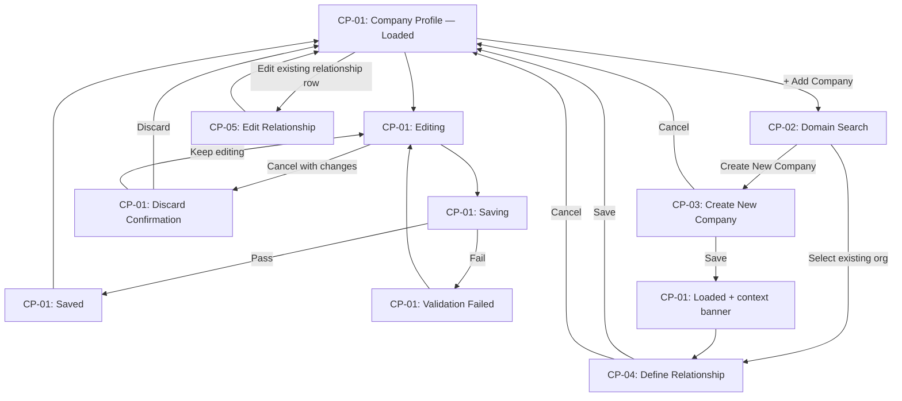

# UX Screen Spec — Company Profile Extended Fields

**Feature:** Company Profile Unified Front-End — Extended Fields (KYB, UBO, Authorized Signatory, Document Requirements, Account Structure)
**Capability ID:** CAP-2026-015
**Phase:** 1 — Unified Shared Company Profile Workspace
**Profile:** BMAD

---

## Actors

| Actor | Role | Access Channel |
|---|---|---|
| HR Administrator | Manages HR-owned fields, Account Type, Related Companies. Read-only on Payroll-only fields. | Web app — HR module |
| Payroll Administrator | Manages Payroll-owned fields. Read-only on HR-only fields. | Web app — Payroll module |
| Super Admin | Full access across all fields, Account Type, and Related Companies. | Web app — either module |

> Finance Business Partner and Compliance Reviewer are indirect / passive — no direct UI actor role in Phase 1.

---

## Screen Inventory

| Screen ID | Screen Name | Actor | States | Routes To |
|---|---|---|---|---|
| CP-01 | Company Profile | HR Admin · Payroll Admin · Super Admin | Loaded · Editing · Saving · Saved · Validation Failed · Discard Confirmation | CP-02 (via + Add Company) · CP-05 (Edit Relationship) |
| CP-02 | Add Company — Domain Search | HR Admin · Super Admin | Idle · Searching · Results · No Results | CP-01 (cancel) · CP-03 (Create New Company) · CP-04 (Define Relationship — after selecting existing org) |
| CP-03 | Create New Company (Scenario B) | HR Admin · Super Admin | Filling · Saving · Validation Failed · Discard Confirmation | CP-01 (cancel without save) · CP-04 (Define Relationship — after save) |
| CP-04 | Define Relationship | HR Admin · Super Admin | Filling · Saving · Validation Failed | CP-01 (after save or cancel) |
| CP-05 | Edit Relationship | HR Admin · Super Admin | View · Editing · Saving · Validation Failed | CP-01 (after save or cancel) |

---

## Flow

---

## Open Design Decisions

| # | Question | Affected Screen(s) | Proposed Default |
|---|---|---|---|
| OD-1 | What pattern opens the domain-scoped list when "+ Add Company" is clicked — modal, slide-out panel, or inline expansion? How does it paginate for tenants with 400+ orgs? | CP-02 | **Slide-out panel** — keeps CP-01 visible for context; paginated list with sticky search |
| OD-2 | How does the user edit an existing relationship row — edit button per row, expandable row, or slide-out drawer? What fields are editable post-save? | CP-05 | **Edit button per row → slide-out drawer** — consistent with OD-1 |
| OD-3 | What does the Related Companies section look like before any companies are added? | CP-01 | Empty state with "+ Add Company" CTA: "No related companies added yet. Click '+ Add Company' to link your first company." |
| OD-4 | If Account Type is changed to Single Company after relationships exist — records preserved but hidden, or warning + confirmation before collapse? | CP-01 | **Warning + confirmation before collapse** — records preserved and hidden until Account Type is changed back |
| OD-5 | If a saved Relationship Type is no longer valid under a new Account Type, does the saved value persist or show a warning? | CP-01 · CP-05 | **Persist with inline warning badge** — "This relationship type may not apply to the current account structure." — unblocking, correctable |
| OD-6 | What UX pattern communicates context after Scenario B company creation and return to CP-01 before Define Relationship? | CP-01 | **Top-of-section banner** — "You created [Org Name]. Now define its relationship to [Current Company Name]." |
| OD-7 | Should the Related Companies table show all statuses by default (including Inactive and Ended), or filter them out? | CP-01 | Active + Pending + Suspended shown by default; Inactive and Ended behind a "Show all" toggle |
| OD-8 | At what row count does the Related Companies table paginate? Is there a filter or search? | CP-01 | **Paginate at 10 rows; search by company name above the table** |
| OD-9 | How to visually distinguish rows where the linked company is itself deactivated vs the relationship being Inactive/Ended? | CP-01 | **Muted row + "Company inactive" badge on company name** — separate from Relationship Status chip |
| OD-10 | Where does Incoming Relationships appear? What does it look like on a Single Company account? What is the hidden state? | CP-01 | **After Related Companies (or after Government Information when Account Type = Single Company)**; hidden entirely when no incoming relationships exist |
| OD-11 | How is "Create New Company" presented in the no-results state of CP-02? | CP-02 | **Inline button below no-results message** — "No company found. [Create New Company →]" |
| OD-12 | In CP-03, is there a back/cancel that discards the creation entirely and returns to CP-01 without creating a record? | CP-03 | **Yes — "Cancel" in Discard Confirmation discards with no record created** |
| OD-13 | "Same as [Current Company]" website URL checkbox in CP-03 when current company has no URL saved — disabled, hidden, or helper message? | CP-03 | **Disabled with tooltip** — "No website URL found for [Current Company Name]. Add a URL to the current company profile first." |
